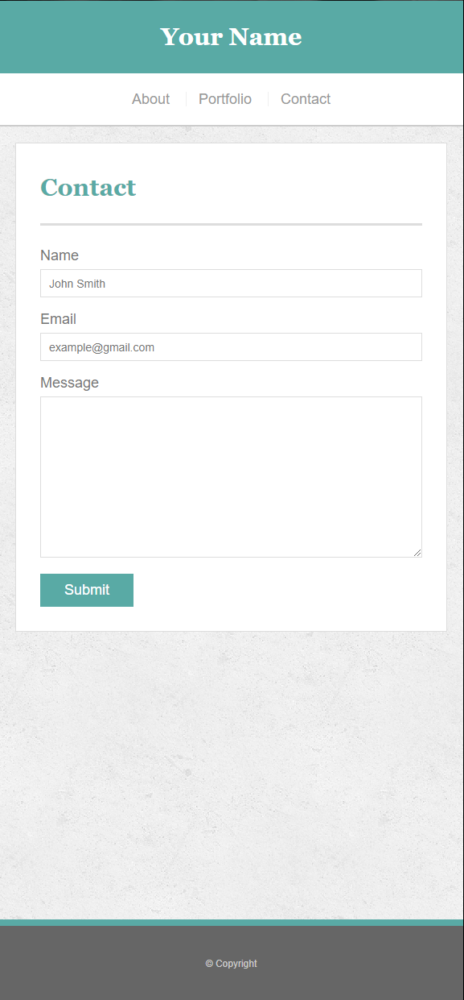

# Responsive-Portfolio-Redo

Part 2 of a 2 part follow up to the <a href="https://github.com/bksaechao/Basic-Portfolio-Redo">previous assignment</a>, but instead of building a portfolio with pure html/css, the second task is to enhance the previous assignment (The Basic Portfolio Redo) with media queries .

(Use the developer tools to view the pages at different screen widths)
<ul>
  <li>
    <a href="https://bksaechao.github.io/Responsive-Portfolio-Redo/">Finished Project</a>
  </li>
  <li>
    <a href="https://bksaechao.github.io/Responsive-Portfolio/">Bootcamp Version</a>
    <ul>
      <li>
        <a href="https://github.com/bksaechao/Responsive-Portfolio">Github</a>
      </li>
    </ul>
  </li>
 </ul>

## Project Details & Requirements
<ul>
<li>
<strong>Enhance the previous basic portfolio assignment with media queries for responsive behavior.</strong>
</li>
<li>
<strong>Examples below:</strong>
</li>
</ul>

<strong>@media screen and (max-width: 980px)</strong>

<strong>@media screen and (max-width: 768px)</strong>

<strong>@media screen and (max-width: 640px)</strong>

### *(Follow up notes)*
<ul>
  <li>
    This assignment was more challenging than I iniitially thought it would be and more challenging than I remember it to be tbh.
  </li>
  <li>
    Finished in one sitting, but ran into many hiccups and bugs and was stumped for a while on how to solve some issues. The portfolio page was the most challenging due to my initial code not being optimized for media queries so I had to re-do the whole page.
  </li>
  <li>
    I've been trying to start from scratch and avoid using previous code as reference, but this time around it was necesssary to get over some hurdles.
  </li>
  <li>
    I need to improve use of proper syntax and common practice methods in web dev.
  </li>
  <li>
    Although it was challenging, comprehension was much stronger this time around!
  </li>
</ul>
